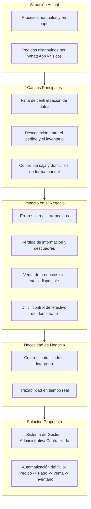

# Vista 1: Resumen del Problema y Necesidad

Esta vista presenta el contexto actual del restaurante de comida de mar, identificando la raíz de los problemas operativos y cómo la solución propuesta se alinea con las necesidades del negocio.

