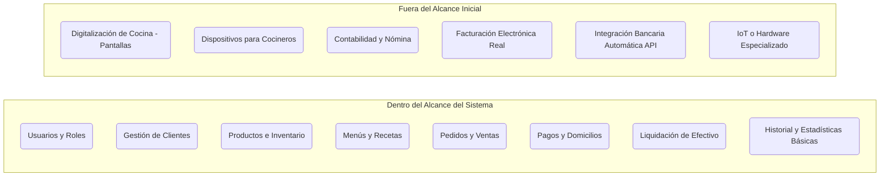

# Vista 2: Alcance del Sistema

Define claramente los límites de la primera versión del sistema, especificando qué módulos se construirán y cuáles quedan fuera de este desarrollo para mantener un enfoque realista y evitar sobreingeniería.

