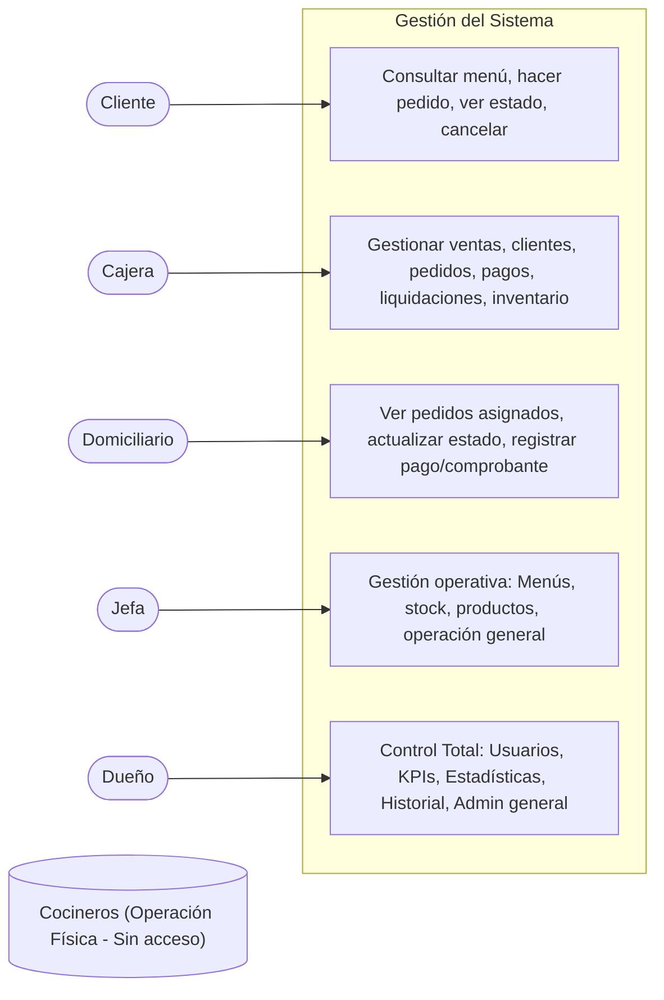

# Vista 3: Mapa de Actores y Funcionalidades (Casos de Uso)

Representa la interacción de cada tipo de usuario con los módulos del sistema. Se omiten explícitamente a los cocineros en las interacciones directas, ya que su operación seguirá siendo física.

