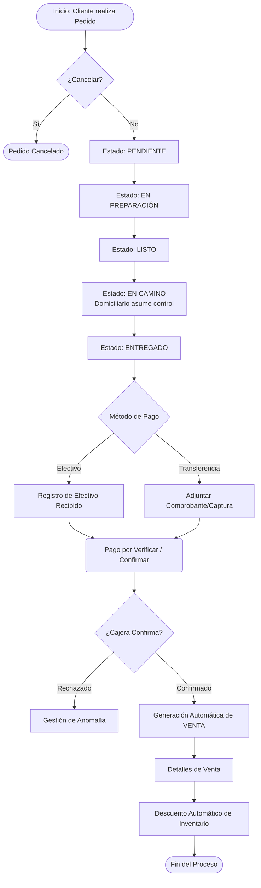

# Vista 4: Flujo de Pedido a Domicilio

Muestra el ciclo de vida de un pedido desde que el cliente lo solicita hasta su conversión final en venta y afectación de inventario.

```mermaid
flowchart TD
    A([Inicio: Cliente realiza Pedido]) --> B{¿Cancelar?}
    B -- Sí --> C([Pedido Cancelado])
    B -- No --> D[Estado: PENDIENTE]

    D --> E[Estado: EN PREPARACIÓN]
    E --> F[Estado: LISTO]

    F --> G[Estado: EN CAMINO 
 Domiciliario asume control]
    G --> H[Estado: ENTREGADO]

    H --> I{Método de Pago}
    I -- Efectivo --> J[Registro de Efectivo Recibido]
    I -- Transferencia --> K[Adjuntar Comprobante/Captura]

    J --> L(Pago por Verificar / Confirmar)
    K --> L

    L --> M{¿Cajera Confirma?}
    M -- Rechazado --> N[Gestión de Anomalía]
    M -- Confirmado --> O[Generación Automática de VENTA]

    O --> P[Detalles de Venta]
    P --> Q[Descuento Automático de Inventario]
    Q --> R([Fin del Proceso])
```