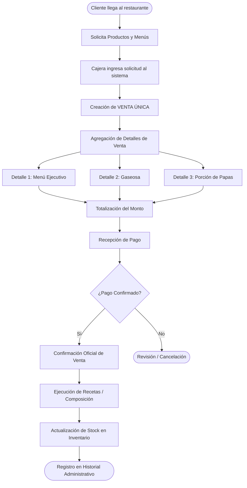

# Vista 5: Flujo de Venta Presencial

Representa la atención directa en el restaurante, mostrando cómo múltiples ítems (menús y productos individuales) se consolidan en una única venta.

```mermaid
flowchart TD
    A([Cliente llega al restaurante]) --> B[Solicita Productos y Menús]
    B --> C[Cajera ingresa solicitud al sistema]

    C --> D[Creación de VENTA ÚNICA]
    D --> E[Agregación de Detalles de Venta]

    E --> E1[Detalle 1: Menú Ejecutivo]
    E --> E2[Detalle 2: Gaseosa]
    E --> E3[Detalle 3: Porción de Papas]

    E1 & E2 & E3 --> F[Totalización del Monto]

    F --> G[Recepción de Pago]
    G --> H{¿Pago Confirmado?}

    H -- Sí --> I[Confirmación Oficial de Venta]
    I --> J[Ejecución de Recetas / Composición]
    J --> K[Actualización de Stock en Inventario]
    K --> L([Registro en Historial Administrativo])

    H -- No --> M([Revisión / Cancelación])
```