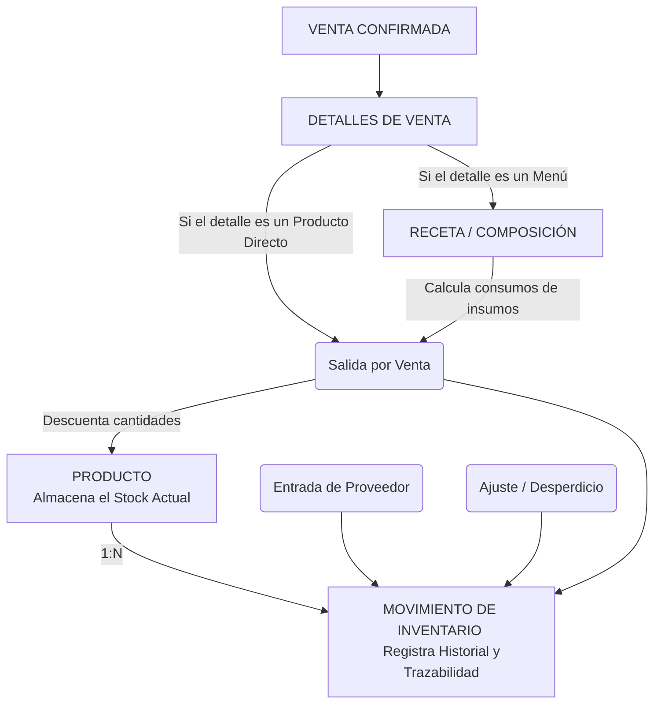

# Vista 6: Flujo de Inventario y Recetas

Explica la relación entre productos (insumos físicos), recetas (composición del menú comercial) y la actualización del stock. 

**Nota de Diseño:** No se crea una tabla separada e innecesaria de "Inventario", el Producto posee su stock actual y los cambios se guardan como movimientos, asegurando alta cohesión y evitando datos duplicados.

