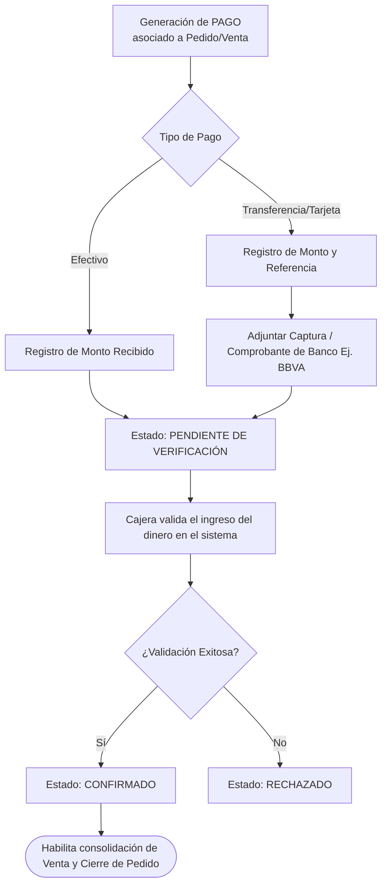

# Vista 7: Flujo de Pagos y Comprobantes

Detalla el ciclo de vida de un pago. El comprobante no requiere inicialmente una entidad separada sobre-ingenierizada; se asocia funcionalmente al pago para permitir su posterior verificación por la cajera.

