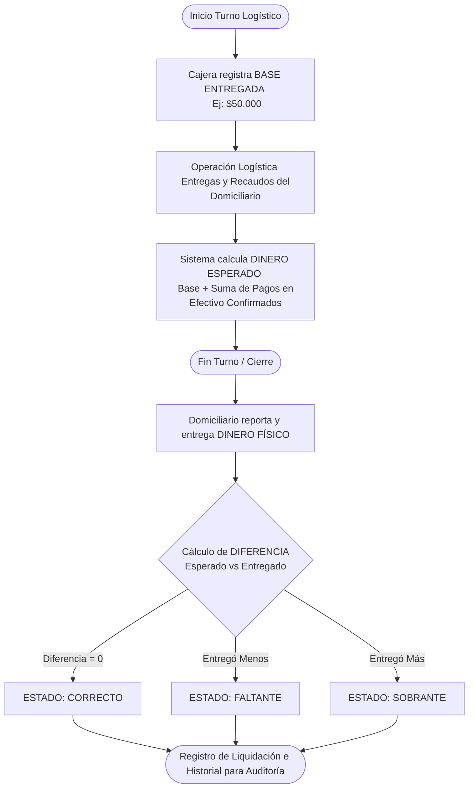

# Vista 8: Liquidación del Domiciliario

Describe el proceso administrativo de control de caja para el domiciliario, garantizando auditoría clara sobre el dinero en efectivo que fluye fuera de las instalaciones del restaurante.

