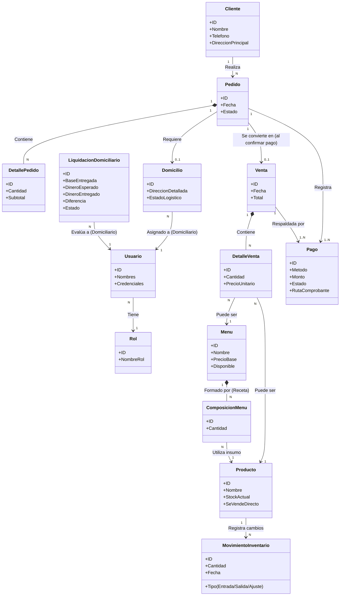

# Vista 9: Modelo Conceptual de Entidades (ER / UML)

Diagrama de Clases / Entidad-Relación que establece las bases del dominio de datos, manteniendo separación de responsabilidades e integridad.

```mermaid
classDiagram
    class Usuario {
        +ID
        +Nombres
        +Credenciales
    }
    class Rol {
        +ID
        +NombreRol
    }
    class Cliente {
        +ID
        +Nombre
        +Telefono
        +DireccionPrincipal
    }
    class Producto {
        +ID
        +Nombre
        +StockActual
        +SeVendeDirecto
    }
    class MovimientoInventario {
        +ID
        +Tipo (Entrada/Salida/Ajuste)
        +Cantidad
        +Fecha
    }
    class Menu {
        +ID
        +Nombre
        +PrecioBase
        +Disponible
    }
    class ComposicionMenu {
        +ID
        +Cantidad
    }
    class Pedido {
        +ID
        +Fecha
        +Estado
    }
    class DetallePedido {
        +ID
        +Cantidad
        +Subtotal
    }
    class Domicilio {
        +ID
        +DireccionDetallada
        +EstadoLogistico
    }
    class Venta {
        +ID
        +Fecha
        +Total
    }
    class DetalleVenta {
        +ID
        +Cantidad
        +PrecioUnitario
    }
    class Pago {
        +ID
        +Metodo
        +Monto
        +Estado
        +RutaComprobante
    }
    class LiquidacionDomiciliario {
        +ID
        +BaseEntregada
        +DineroEsperado
        +DineroEntregado
        +Diferencia
        +Estado
    }

    Usuario "N" --> "1" Rol : Tiene
    Cliente "1" --> "N" Pedido : Realiza
    Pedido "1" *-- "N" DetallePedido : Contiene
    Pedido "1" --> "0..1" Domicilio : Requiere
    Pedido "1" --> "1..N" Pago : Registra
    Pedido "1" --> "0..1" Venta : Se convierte en (al confirmar pago)
    Venta "1" *-- "N" DetalleVenta : Contiene
    Venta "1" --> "1..N" Pago : Respaldada por
    DetalleVenta "N" --> "1" Menu : Puede ser
    DetalleVenta "N" --> "1" Producto : Puede ser
    Menu "1" *-- "N" ComposicionMenu : Formado por (Receta)
    ComposicionMenu "N" --> "1" Producto : Utiliza insumo
    Producto "1" --> "N" MovimientoInventario : Registra cambios
    Domicilio "N" --> "1" Usuario : Asignado a (Domiciliario)
    LiquidacionDomiciliario "N" --> "1" Usuario : Evalúa a (Domiciliario)
```