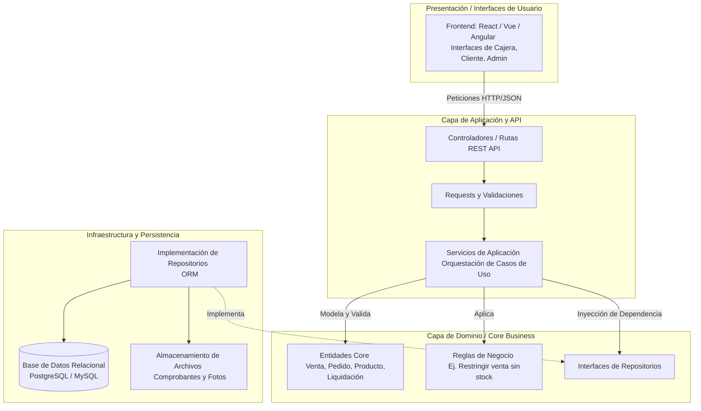

# Vista 10: Arquitectura del Sistema (Diseño por Capas)

Propuesta de arquitectura basada en Domain-Driven Design (DDD) simplificado / Clean Architecture. Proporciona separación de responsabilidades para mantener el software escalable y facilitar las pruebas, sin la sobrecarga de patrones extremadamente complejos innecesarios para el tamaño del negocio.

